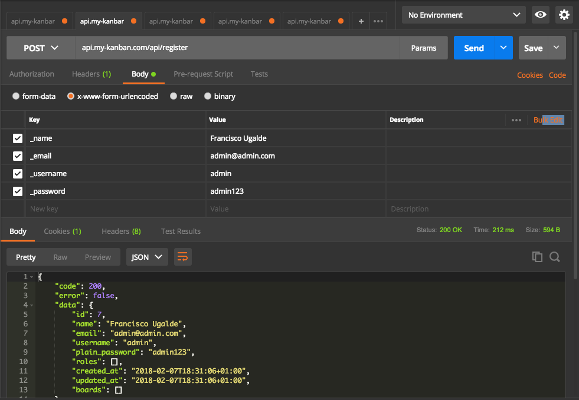
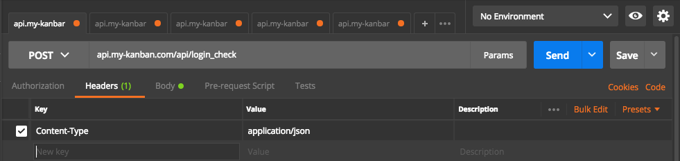
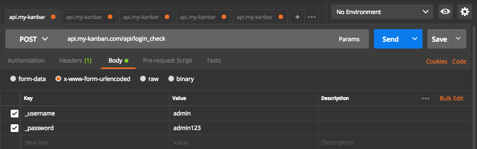
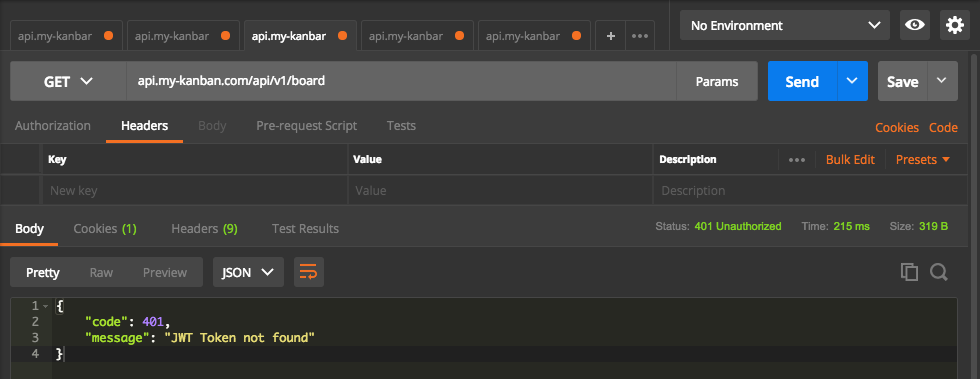
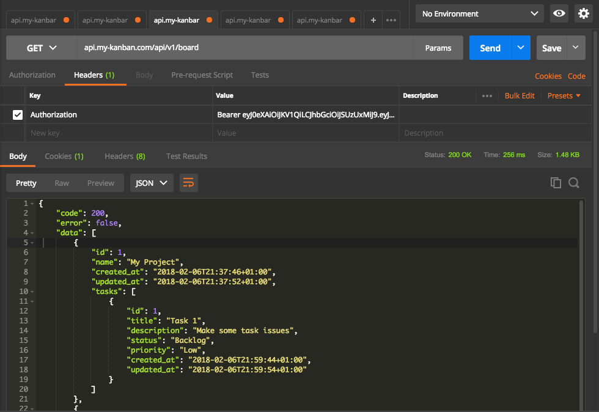
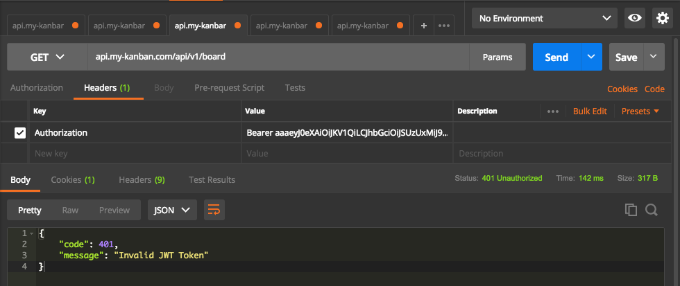

Continuamos con esta serie de posts donde explico de manera detallada como construir un **RESTful API con Symfony 4 + JWT.**

En el [**post anterior**](https://www.franciscougalde.com/2018/02/19/construir-restful-api-symfony-4-jwt-parte-2/), nos dedicamos a instalar **Symfony 4**, a instalar los bundles y paquetes necesarios para nuestra aplicación y a su vez, creamos las entidades requeridas para este caso práctico.

Ya con lo anteriormente listo, vamos a proceder con el desarrollo del **RESTful API**, para ello seguiremos los siguientes pasos:

1. [Configuración de los bundles para nuestro **RESTful API.**](#configuracion-restful-api)
2. [Creación de los servicios (endpoints) del **API.**](#creacion-servicios-api)
3. [Test de los servicios del **API** con Postman.](#test-servicios-api)

## Configuración de los bundles para nuestro **RESTful API.**

Iré colocando la configuración que se debe establecer para cada bundle y componente que sea necesario en función de hacer que nuestro **RESTful API** quede correctamente configurado y funcional.

#### Configuración para el bundle JWT:

##### Crear certificados SSH para JWT

Para esto debemos ejecutar los siguientes comandos:

\# Creamos el directorio jwt.
mkdir config/jwt

# Generamos el certificado privado utilizando el pass phrase "mykanban".
openssl genrsa -out config/jwt/private.pem -aes256 4096

# Generamos el certificado público introduciendo el pass phrase "mykanban"
# cuando nos lo solicite.
openssl rsa -pubout -in config/jwt/private.pem -out config/jwt/public.pem

##### Parámetros de JWT en archivo .env se establecen de la siguiente forma:

###> lexik/jwt-authentication-bundle ###
# Key paths should be relative to the project directory
JWT\_PRIVATE\_KEY\_PATH=config/jwt/private.pem
JWT\_PUBLIC\_KEY\_PATH=config/jwt/public.pem
JWT\_PASSPHRASE=mykanban
JWT\_TOKENTTL=3600
###< lexik/jwt-authentication-bundle ###

##### Parámetros del paquete Lexik/jwt-authentication-bundle en el archivo "**config/packages/lexik\_jwt\_authenticantion.yaml"** se establecen de la siguiente forma:

lexik\_jwt\_authentication:
    private\_key\_path: '%kernel.project\_dir%/%env(JWT\_PRIVATE\_KEY\_PATH)%'
    public\_key\_path:  '%kernel.project\_dir%/%env(JWT\_PUBLIC\_KEY\_PATH)%'
    pass\_phrase:      '%env(JWT\_PASSPHRASE)%'
    token\_ttl:        '%env(JWT\_TOKENTTL)%'
    encoder:
        service: lexik\_jwt\_authentication.encoder.lcobucci
        signature\_algorithm: RS512

##### El archivo **security.yaml** ubicado en "**config/packages"** debe quedar de la siguiente manera:

security:
    encoders:
        App\\Entity\\User:
            algorithm: sha512

    providers:
        api\_user\_provider:
            entity:
                class: App\\Entity\\User
                property: username

    firewalls:
        login:
            pattern:  ^/api/login
            stateless: true
            anonymous: true
            form\_login:
                check\_path:               /api/login\_check
                success\_handler:          lexik\_jwt\_authentication.handler.authentication\_success
                failure\_handler:          lexik\_jwt\_authentication.handler.authentication\_failure
                require\_previous\_session: false

        api:
            pattern:   ^/api/v1
            stateless: true
            anonymous: false
            provider: api\_user\_provider
            guard:
                authenticators:
                    - lexik\_jwt\_authentication.jwt\_token\_authenticator

    access\_control:
        - { path: ^/api/login\_check, roles: IS\_AUTHENTICATED\_ANONYMOUSLY }
        - { path: ^/api/login, roles: IS\_AUTHENTICATED\_ANONYMOUSLY }
        - { path: ^/api/register, roles: IS\_AUTHENTICATED\_ANONYMOUSLY }
        - { path: ^/api/v1,       roles: IS\_AUTHENTICATED\_FULLY }

##### Creación de un Controlador para nuestro API

Crearemos el controlador "**ApiController**" para generar todos los métodos relacionados con nuestro **API**. El controlador lo crearemos en el directorio "**src/Controller**". Inicialmente nuestro controlador debe lucir así:

<?php
/\*\*
 \* ApiController.php
 \*
 \* API Controller
 \*
 \* @category   Controller
 \* @package    MyKanban
 \* @author     Francisco Ugalde
 \* @copyright  2018 www.franciscougalde.com
 \* @license    http://www.php.net/license/3\_0.txt  PHP License 3.0
 \*/

namespace App\\Controller;

use App\\Entity\\User;
use App\\Entity\\Task;
use App\\Entity\\User;
use FOS\\RestBundle\\Controller\\Annotations as Rest;
use FOS\\RestBundle\\Controller\\FOSRestController;
use Symfony\\Component\\Config\\Definition\\Exception\\Exception;
use Symfony\\Component\\HttpFoundation\\JsonResponse;
use Symfony\\Component\\HttpFoundation\\Request;
use Symfony\\Component\\HttpFoundation\\Response;
use Symfony\\Component\\Routing\\Annotation\\Route;
use Symfony\\Component\\Security\\Core\\Encoder\\UserPasswordEncoderInterface;
use Nelmio\\ApiDocBundle\\Annotation\\Model;
use Swagger\\Annotations as SWG;

/\*\*
 \* Class ApiController
 \*
 \* @Route("/api")
 \*/
class ApiController extends Controller
{

    /\*\*
     \* @Route("/login\_check", name="login\_check")
     \*/
    public function loginCheckAction() {}

}

#### Configuración para el bundle nelmio/api-doc-bundle:

##### Archivo "**config/packages/nelmio\_api\_doc.yaml**" debe lucir así:

nelmio\_api\_doc:
    documentation:
        info:
            title: My Kanban API
            description: Este es el RESTful API de My Kanban
            version: 1.0.0
    routes: # to filter documented routes
        path\_patterns:
            - ^/api(?!/doc$) # Accepts routes under /api except /api/doc

##### Agregar la siguiente ruta en nuestro archivo "**config/routes.yaml**":

app.swagger\_ui:
    path: /api/doc
    methods: GET
    defaults: { \_controller: nelmio\_api\_doc.controller.swagger\_ui }

El resto de los bundles no necesitan configuración ya que con la que **Symfony Flex** genera por nosotros automáticamente, es suficiente para el desarrollo de nuestra aplicación de ejemplo.

## Creación de los servicios (endpoints) del API.

Ya tenemos todo listo para proceder a crear los endpoints del API. Recordando un poco las URI´s diseñadas anteriormente tenemos:

user:
 - register: POST /api/register
 - login: POST /api/login\_check

board:
 - add: POST /api/v1/board
 - edit: PUT /api/v1/board
 - delete: DELETE /api/v1/board/{id}
 - list: GET /api/v1/board
 - list-item: GET /api/v1/board/{id}

task:
 - add: POST /api/v1/task
 - edit: PUT /api/v1/task
 - delete: DELETE /api/v1/task/{id}

Para definir un endpoint en **Symfony** es sumamente sencillo, ya que con la ayuda del bundle **[FOSRestBundle](https://github.com/FriendsOfSymfony/FOSRestBundle) **y las anotaciones que pone a disposición para tal motivo, es tarea fácil. Solo debemos entonces crear un método para cada ruta diseñada anteriormente y agregar estas anotaciones para indicarle a **Symfony** como debe comportarse al momento de que hagamos cada una de las peticiones (**Requests**) a nuestro **API**.

Adicionalmente, el bundle **[ApiDocBundle](https://github.com/nelmio/NelmioApiDocBundle) **nos provee también de ciertas anotaciones para documentar nuestro **API **(cosa que es sumamente importante y más cuando se trate de un **API** enorme), las cuales este bundle se encargará de digerir dicha información y ponernos a disposición una ruta (suele ser /api/doc) para consultar dicha documentación.

A continuación muestro como queda nuestro controlador **ApiController **con cada uno de los endpoints definidos y las anotaciones respectivas.

<?php
/\*\*
 \* ApiController.php
 \*
 \* API Controller
 \*
 \* @category   Controller
 \* @package    MyKanban
 \* @author     Francisco Ugalde
 \* @copyright  2018 www.franciscougalde.com
 \* @license    http://www.php.net/license/3\_0.txt  PHP License 3.0
 \*/

namespace App\\Controller;

use App\\Entity\\Board;
use App\\Entity\\Task;
use App\\Entity\\User;
use FOS\\RestBundle\\Controller\\Annotations as Rest;
use FOS\\RestBundle\\Controller\\FOSRestController;
use Symfony\\Component\\Config\\Definition\\Exception\\Exception;
use Symfony\\Component\\HttpFoundation\\JsonResponse;
use Symfony\\Component\\HttpFoundation\\Request;
use Symfony\\Component\\HttpFoundation\\Response;
use Symfony\\Component\\Routing\\Annotation\\Route;
use Symfony\\Component\\Security\\Core\\Encoder\\UserPasswordEncoderInterface;
use Nelmio\\ApiDocBundle\\Annotation\\Model;
use Swagger\\Annotations as SWG;

/\*\*
 \* Class ApiController
 \*
 \* @Route("/api")
 \*/
class ApiController extends FOSRestController
{
    // USER URI's

    /\*\*
     \* @Rest\\Post("/login\_check", name="user\_login\_check")
     \*
     \* @SWG\\Response(
     \*     response=200,
     \*     description="User was logged in successfully"
     \* )
     \*
     \* @SWG\\Response(
     \*     response=500,
     \*     description="User was not logged in successfully"
     \* )
     \*
     \* @SWG\\Parameter(
     \*     name="\_username",
     \*     in="body",
     \*     type="string",
     \*     description="The username",
     \*     schema={
     \*     }
     \* )
     \*
     \* @SWG\\Parameter(
     \*     name="\_password",
     \*     in="body",
     \*     type="string",
     \*     description="The password",
     \*     schema={}
     \* )
     \*
     \* @SWG\\Tag(name="User")
     \*/
    public function getLoginCheckAction() {}

    /\*\*
     \* @Rest\\Post("/register", name="user\_register")
     \*
     \* @SWG\\Response(
     \*     response=201,
     \*     description="User was successfully registered"
     \* )
     \*
     \* @SWG\\Response(
     \*     response=500,
     \*     description="User was not successfully registered"
     \* )
     \*
     \* @SWG\\Parameter(
     \*     name="\_name",
     \*     in="body",
     \*     type="string",
     \*     description="The username",
     \*     schema={}
     \* )
     \*
     \* @SWG\\Parameter(
     \*     name="\_email",
     \*     in="body",
     \*     type="string",
     \*     description="The username",
     \*     schema={}
     \* )
     \*
     \* @SWG\\Parameter(
     \*     name="\_username",
     \*     in="body",
     \*     type="string",
     \*     description="The username",
     \*     schema={}
     \* )
     \*
     \* @SWG\\Parameter(
     \*     name="\_password",
     \*     in="query",
     \*     type="string",
     \*     description="The password"
     \* )
     \*
     \* @SWG\\Tag(name="User")
     \*/
    public function registerAction(Request $request, UserPasswordEncoderInterface $encoder) {
        $serializer = $this->get('jms\_serializer');
        $em = $this->getDoctrine()->getManager();

        $user = \[\];
        $message = "";

        try {
            $code = 200;
            $error = false;

            $name = $request->request->get('\_name');
            $email = $request->request->get('\_email');
            $username = $request->request->get('\_username');
            $password = $request->request->get('\_password');

            $user = new User();
            $user->setName($name);
            $user->setEmail($email);
            $user->setUsername($username);
            $user->setPlainPassword($password);
            $user->setPassword($encoder->encodePassword($user, $password));

            $em->persist($user);
            $em->flush();

        } catch (Exception $ex) {
            $code = 500;
            $error = true;
            $message = "An error has occurred trying to register the user - Error: {$ex->getMessage()}";
        }

        $response = \[
            'code' => $code,
            'error' => $error,
            'data' => $code == 200 ? $user : $message,
        \];

        return new Response($serializer->serialize($response, "json"));
    }

    // BOARD URI's

    /\*\*
     \* @Rest\\Get("/v1/board.{\_format}", name="board\_list\_all", defaults={"\_format":"json"})
     \*
     \* @SWG\\Response(
     \*     response=200,
     \*     description="Gets all boards for current logged user."
     \* )
     \*
     \* @SWG\\Response(
     \*     response=500,
     \*     description="An error has occurred trying to get all user boards."
     \* )
     \*
     \* @SWG\\Parameter(
     \*     name="id",
     \*     in="query",
     \*     type="string",
     \*     description="The board ID"
     \* )
     \*
     \*
     \* @SWG\\Tag(name="Board")
     \*/
    public function getAllBoardAction(Request $request) {
        $serializer = $this->get('jms\_serializer');
        $em = $this->getDoctrine()->getManager();
        $boards = \[\];
        $message = "";

        try {
            $code = 200;
            $error = false;

            $userId = $this->getUser()->getId();
            $boards = $em->getRepository("App:Board")->findBy(\[
                "user" => $userId,
            \]);

            if (is\_null($boards)) {
                $boards = \[\];
            }

        } catch (Exception $ex) {
            $code = 500;
            $error = true;
            $message = "An error has occurred trying to get all Boards - Error: {$ex->getMessage()}";
        }

        $response = \[
            'code' => $code,
            'error' => $error,
            'data' => $code == 200 ? $boards : $message,
        \];

        return new Response($serializer->serialize($response, "json"));
    }

    /\*\*
     \* @Rest\\Get("/v1/board/{id}.{\_format}", name="board\_list", defaults={"\_format":"json"})
     \*
     \* @SWG\\Response(
     \*     response=200,
     \*     description="Gets board info based on passed ID parameter."
     \* )
     \*
     \* @SWG\\Response(
     \*     response=400,
     \*     description="The board with the passed ID parameter was not found or doesn't exist."
     \* )
     \*
     \* @SWG\\Parameter(
     \*     name="id",
     \*     in="path",
     \*     type="string",
     \*     description="The board ID"
     \* )
     \*
     \*
     \* @SWG\\Tag(name="Board")
     \*/
    public function getBoardAction(Request $request, $id) {
        $serializer = $this->get('jms\_serializer');
        $em = $this->getDoctrine()->getManager();
        $board = \[\];
        $message = "";

        try {
            $code = 200;
            $error = false;

            $board\_id = $id;
            $board = $em->getRepository("App:Board")->find($board\_id);

            if (is\_null($board)) {
                $code = 500;
                $error = true;
                $message = "The board does not exist";
            }

        } catch (Exception $ex) {
            $code = 500;
            $error = true;
            $message = "An error has occurred trying to get the current Board - Error: {$ex->getMessage()}";
        }

        $response = \[
            'code' => $code,
            'error' => $error,
            'data' => $code == 200 ? $board : $message,
        \];

        return new Response($serializer->serialize($response, "json"));
    }

    /\*\*
     \* @Rest\\Post("/v1/board.{\_format}", name="board\_add", defaults={"\_format":"json"})
     \*
     \* @SWG\\Response(
     \*     response=201,
     \*     description="Board was added successfully"
     \* )
     \*
     \* @SWG\\Response(
     \*     response=500,
     \*     description="An error was occurred trying to add new board"
     \* )
     \*
     \* @SWG\\Parameter(
     \*     name="name",
     \*     in="body",
     \*     type="string",
     \*     description="The board name",
     \*     schema={}
     \* )
     \*
     \* @SWG\\Tag(name="Board")
     \*/
    public function addBoardAction(Request $request) {
        $serializer = $this->get('jms\_serializer');
        $em = $this->getDoctrine()->getManager();
        $board = \[\];
        $message = "";

        try {
           $code = 201;
           $error = false;
           $name = $request->request->get("name", null);
           $user = $this->getUser();

           if (!is\_null($name)) {
               $board = new Board();
               $board->setName($name);
               $board->setUser($user);

               $em->persist($board);
               $em->flush();

           } else {
               $code = 500;
               $error = true;
               $message = "An error has occurred trying to add new board - Error: You must to provide a board name";
           }

        } catch (Exception $ex) {
            $code = 500;
            $error = true;
            $message = "An error has occurred trying to add new board - Error: {$ex->getMessage()}";
        }

        $response = \[
            'code' => $code,
            'error' => $error,
            'data' => $code == 201 ? $board : $message,
        \];

        return new Response($serializer->serialize($response, "json"));
    }

    /\*\*
     \* @Rest\\Put("/v1/board/{id}.{\_format}", name="board\_edit", defaults={"\_format":"json"})
     \*
     \* @SWG\\Response(
     \*     response=200,
     \*     description="The board was edited successfully."
     \* )
     \*
     \* @SWG\\Response(
     \*     response=500,
     \*     description="An error has occurred trying to edit the board."
     \* )
     \*
     \* @SWG\\Parameter(
     \*     name="id",
     \*     in="path",
     \*     type="string",
     \*     description="The board ID"
     \* )
     \*
     \* @SWG\\Parameter(
     \*     name="name",
     \*     in="body",
     \*     type="string",
     \*     description="The board name",
     \*     schema={}
     \* )
     \*
     \*
     \* @SWG\\Tag(name="Board")
     \*/
    public function editBoardAction(Request $request, $id) {
        $serializer = $this->get('jms\_serializer');
        $em = $this->getDoctrine()->getManager();
        $board = \[\];
        $message = "";

        try {
            $code = 200;
            $error = false;
            $name = $request->request->get("name", null);
            $board = $em->getRepository("App:Board")->find($id);

            if (!is\_null($name) && !is\_null($board)) {
                $board->setName($name);

                $em->persist($board);
                $em->flush();

            } else {
                $code = 500;
                $error = true;
                $message = "An error has occurred trying to add new board - Error: You must to provide a board name or the board id does not exist";
            }

        } catch (Exception $ex) {
            $code = 500;
            $error = true;
            $message = "An error has occurred trying to edit the current board - Error: {$ex->getMessage()}";
        }

        $response = \[
            'code' => $code,
            'error' => $error,
            'data' => $code == 200 ? $board : $message,
        \];

        return new Response($serializer->serialize($response, "json"));
    }

    /\*\*
     \* @Rest\\Delete("/v1/board/{id}.{\_format}", name="board\_remove", defaults={"\_format":"json"})
     \*
     \* @SWG\\Response(
     \*     response=200,
     \*     description="Board was successfully removed"
     \* )
     \*
     \* @SWG\\Response(
     \*     response=400,
     \*     description="An error was occurred trying to remove the board"
     \* )
     \*
     \* @SWG\\Parameter(
     \*     name="id",
     \*     in="path",
     \*     type="string",
     \*     description="The board ID"
     \* )
     \*
     \* @SWG\\Tag(name="Board")
     \*/
    public function deleteBoardAction(Request $request, $id) {
        $serializer = $this->get('jms\_serializer');
        $em = $this->getDoctrine()->getManager();

        try {
            $code = 200;
            $error = false;
            $board = $em->getRepository("App:Board")->find($id);

            if (!is\_null($board)) {
                $em->remove($board);
                $em->flush();

                $message = "The board was removed successfully!";

            } else {
                $code = 500;
                $error = true;
                $message = "An error has occurred trying to remove the currrent board - Error: The board id does not exist";
            }

        } catch (Exception $ex) {
            $code = 500;
            $error = true;
            $message = "An error has occurred trying to remove the current board - Error: {$ex->getMessage()}";
        }

        $response = \[
            'code' => $code,
            'error' => $error,
            'data' => $message,
        \];

        return new Response($serializer->serialize($response, "json"));
    }

    // TASK URI's

    /\*\*
     \* @Rest\\Post("/v1/task.{\_format}", name="task\_add", defaults={"\_format":"json"})
     \*
     \* @SWG\\Response(
     \*     response=201,
     \*     description="Task was added successfully"
     \* )
     \*
     \* @SWG\\Response(
     \*     response=500,
     \*     description="An error was occurred trying to add new task"
     \* )
     \*
     \* @SWG\\Parameter(
     \*     name="title",
     \*     in="body",
     \*     type="string",
     \*     description="The task title",
     \*     schema={}
     \* )
     \*
     \* @SWG\\Parameter(
     \*     name="description",
     \*     in="body",
     \*     type="string",
     \*     description="The task description",
     \*     schema={}
     \* )
     \*
     \* @SWG\\Parameter(
     \*     name="status",
     \*     in="body",
     \*     type="string",
     \*     description="The task status. Allowed values: Backlog, Working, Done",
     \*     schema={}
     \* )
     \*
     \* @SWG\\Parameter(
     \*     name="priority",
     \*     in="body",
     \*     type="string",
     \*     description="The task priority. Allowed values: High, Medium, Low",
     \*     schema={}
     \* )
     \*
     \* @SWG\\Parameter(
     \*     name="board\_id",
     \*     in="body",
     \*     type="string",
     \*     description="The board id of the new task",
     \*     schema={}
     \* )
     \*
     \* @SWG\\Tag(name="Task")
     \*/
    public function addTaskAction(Request $request) {
        $serializer = $this->get('jms\_serializer');
        $em = $this->getDoctrine()->getManager();
        $task = \[\];
        $message = "";

        try {
            $code = 201;
            $error = false;
            $title = $request->request->get("title", null);
            $description = $request->request->get("description", null);
            $status = $request->request->get("status", null);
            $priority = $request->request->get("priority", null);
            $boardId= $request->request->get("board\_id", null);

            if (!is\_null($title) && !is\_null($description) && !is\_null($status) && !is\_null($priority) && !is\_null($boardId)) {
                $task = new Task();
                $board = $em->getRepository("App:Board")->find($boardId);
                $task->setBoard($board);
                $task->setTitle($title);
                $task->setDescription($description);
                $task->setStatus($status);
                $task->setPriority($priority);

                $em->persist($task);
                $em->flush();

            } else {
                $code = 500;
                $error = true;
                $message = "An error has occurred trying to add new task - Error: You must to provide all the required fields";
            }

        } catch (Exception $ex) {
            $code = 500;
            $error = true;
            $message = "An error has occurred trying to add new task - Error: {$ex->getMessage()}";
        }

        $response = \[
            'code' => $code,
            'error' => $error,
            'data' => $code == 201 ? $task : $message,
        \];

        return new Response($serializer->serialize($response, "json"));
    }

    /\*\*
     \* @Rest\\Put("/v1/task/{id}.{\_format}", name="task\_edit", defaults={"\_format":"json"})
     \*
     \* @SWG\\Response(
     \*     response=200,
     \*     description="The task was edited successfully."
     \* )
     \*
     \* @SWG\\Response(
     \*     response=500,
     \*     description="An error has occurred trying to edit the task."
     \* )
     \*
     \* @SWG\\Parameter(
     \*     name="id",
     \*     in="path",
     \*     type="string",
     \*     description="The task ID"
     \* )
     \*
     \* @SWG\\Parameter(
     \*     name="title",
     \*     in="body",
     \*     type="string",
     \*     description="The task title",
     \*     schema={}
     \* )
     \*
     \* @SWG\\Parameter(
     \*     name="description",
     \*     in="body",
     \*     type="string",
     \*     description="The task description",
     \*     schema={}
     \* )
     \*
     \* @SWG\\Parameter(
     \*     name="status",
     \*     in="body",
     \*     type="string",
     \*     description="The task status. Allowed values: Backlog, Working, Done",
     \*     schema={}
     \* )
     \*
     \* @SWG\\Parameter(
     \*     name="priority",
     \*     in="body",
     \*     type="string",
     \*     description="The task priority. Allowed values: High, Medium, Low",
     \*     schema={}
     \* )
     \*
     \*
     \* @SWG\\Tag(name="Task")
     \*/
    public function editTaskAction(Request $request, $id) {
        $serializer = $this->get('jms\_serializer');
        $em = $this->getDoctrine()->getManager();
        $task = \[\];
        $message = "";

        try {
            $code = 200;
            $error = false;
            $title = $request->request->get("title", null);
            $description = $request->request->get("description", null);
            $status = $request->request->get("status", null);
            $priority = $request->request->get("priority", null);
            $task = $em->getRepository("App:Task")->find($id);

            if (!is\_null($task)) {
                if (!is\_null($title)) {
                    $task->setTitle($title);
                }

                if (!is\_null($description)) {
                    $task->setDescription($description);
                }

                if (!is\_null($status)) {
                    $task->setStatus($status);
                }

                if (!is\_null($priority)) {
                    $task->setPriority($priority);
                }

                $em->persist($task);
                $em->flush();

            } else {
                $code = 500;
                $error = true;
                $message = "An error has occurred trying to edit the current task - Error: The task id does not exist";
            }

        } catch (Exception $ex) {
            $code = 500;
            $error = true;
            $message = "An error has occurred trying to edit the current task - Error: {$ex->getMessage()}";
        }

        $response = \[
            'code' => $code,
            'error' => $error,
            'data' => $code == 200 ? $task : $message,
        \];

        return new Response($serializer->serialize($response, "json"));
    }

    /\*\*
     \* @Rest\\Delete("/v1/task/{id}.{\_format}", name="task\_remove", defaults={"\_format":"json"})
     \*
     \* @SWG\\Response(
     \*     response=200,
     \*     description="Task was successfully removed"
     \* )
     \*
     \* @SWG\\Response(
     \*     response=400,
     \*     description="An error was occurred trying to remove the task"
     \* )
     \*
     \* @SWG\\Parameter(
     \*     name="id",
     \*     in="path",
     \*     type="string",
     \*     description="The board ID"
     \* )
     \*
     \* @SWG\\Tag(name="Task")
     \*/
    public function deleteTaskAction(Request $request, $id) {
        $serializer = $this->get('jms\_serializer');
        $em = $this->getDoctrine()->getManager();

        try {
            $code = 200;
            $error = false;
            $task = $em->getRepository("App:Task")->find($id);

            if (!is\_null($task)) {
                $em->remove($task);
                $em->flush();

                $message = "The task was removed successfully!";

            } else {
                $code = 500;
                $error = true;
                $message = "An error has occurred trying to remove the currrent task - Error: The task id does not exist";
            }

        } catch (Exception $ex) {
            $code = 500;
            $error = true;
            $message = "An error has occurred trying to remove the current task - Error: {$ex->getMessage()}";
        }

        $response = \[
            'code' => $code,
            'error' => $error,
            'data' => $message,
        \];

        return new Response($serializer->serialize($response, "json"));
    }

    /\*\*
     \* @Route("/v1/", name="api")
     \*/
    public function api()
    {
        return new Response(sprintf('Logged in as %s', $this->getUser()->getUsername()));
    }

}

Y con esto, tenemos listo nuestro **RESTful API**, siguiendo muchas de las buenas practicas mas comunes como la documentación de nuestro API, convenciones en nuestras URI's, entre otros. Podemos resumir que a pesar de haber tenido que instalar varios paquetes, componentes y dependencias, al final del camino sigue siendo bastante sencillo utilizar Symfony como proveedor de nuestro **RESTful API** sobre todo puesto que gracias a la forma que nos ha inculcado este framework, estaremos siempre alineados y trabajando de forma ordenada y pensando siempre en que en mucho de los casos, seremos equipos de trabajo quienes uniremos esfuerzos en un mismo proyecto para llevar a cabo los objetivos.

Otro tema importante que no tocaré a fondo en este post es sobre la documentación de API´s mediante el uso del bundle para symfony: [**nelmio/api-doc-bundle**](https://symfony.com/doc/current/bundles/NelmioApiDocBundle/index.html). Te recomiendo leer un poco en su documentación para entender un poco más a detalle sobre todas las anotaciones que pone a nuestra disposición para tal motivo.

Ahora solo resta probar nuestro RESTful API para corroborar que cada verbo de HTTP este funcionando como debe, y adicionalmente, que nuestro código este funcionando como se requiere.

## Test de los servicios del API con Postman.

Postman es una herramienta maravillosa para ayudarnos en el proceso de desarrollo de nuestro API, ya que permite visualmente, y con muchísimas opciones interesantes, diseñar, gestionar y probar nuestro API de forma rápida y sencilla. Te recomiendo leer mi post sobre esta maravillosa herramienta: **Postman: Como gestionar y construir tus API's de forma rápida y sencilla** para conocer un poco más de lo que nos ofrece esta interesante y super útil herramienta.

Antes de empezar con las pruebas quiero acotar lo siguiente:

- Para este proyecto, en mi caso particular configuré mi servidor web con un virtual host el cual responde a la siguiente url: **http://api.my-kanban.com**. Tú también puedes configurar uno propio o bien acceder utilizando el path común **http://localhost/my\_kanban**.
- Para visualizar como quedó la documentación de nuestro API, basta con acceder a la ruta **/api/doc**, es decir, **http://localhost/my\_kanban/api/doc**.
- No es obligatorio probar nuestro **API** utilizando **Postman**, podemos simplemente utilizar **cUrl** desde nuestra terminal o **Httpie** el cual es un programa que corre desde consola y también nos provee de forma rápida una manera de probar nuestros endpoints.

Voy a explicar brevemente como realizar las pruebas con Postman y para que de cierta forma puedan entender como funciona la seguridad de JWT y como es requerido en nuestros servicios que requieren que estemos autenticados según la configuración realizada en el archivo **security.yaml**.

Lo primero es hacer una petición **POST** a nuestro endpoint de register cuyo path es **/api/register**. Lo haremos de la siguiente forma:

La ruta en mi caso es **http://api.my-kanban.com/api/register**

Luego que hayamos registrado un usuario, procederemos a autenticarnos para que podamos obtener el Token necesario para poder realizar las siguientes peticiones a nuestros endpoints protegidos.

En la sección de **Headers**, debemos agregar la cabecera **Content-Type** con el valor **application/json**

Y en la sección del **Body**, colocar los siguientes parámetros para enviar nuestros datos de acceso:

Hacemos click sobre el botón **Send**, y si todo va bien, nos debe responder el servicio con el respectivo token:

Ahora, con este token, podemos realizar las siguientes peticiones a nuestros endpoints, enviendo dicho token en los headers de cada una. Para no extender tanto el post, voy a solicitar el listado de boards utilizando el método GET y el path **/api/v1/board**, primero sin enviar el token, luego enviándo el correcto y uno fake para demostrar que la seguridad esta funcionando como debe ser.

Vale la pena destacar, que el token se debe enviar en el header de la petición en la variable **"Authorization" **y cuyo valor debe ser el token precedido por la palabra "**Bearer"**.

**GET http://api-my-kanban.com/api/v1/board sin token**

**GET http://api-my-kanban.com/api/v1/board con token**

**GET http://api-my-kanban.com/api/v1/board con token inválido**

Como podemos observar, nuestros servicios están funcionando. Podemos registrarnos, hacer login para obtener el respectivo token, y con este, realizar peticiones a los demas endpoints protegidos para realizar la funcionalidad completa de nuestra aplicación.

Te invito a que realizes como tarea el resto de las peticiones siguiendo como ayuda los endpoints definidos en la documentación del **API **(http://localhost/my\_kanban/api/doc). 

Adicionalmente, te dejo todo el código del proyecto en mi [**repositorio** **de GitHub**](https://github.com/fjugaldev/my_kanban).

Y hasta aquí llega esta pequeña pero nutritiva serie de posts sobre como crear un **RESTFul API con Symfony 4 + JWT.**

Si te gustó este post, ayúdame a que pueda servirle a muchas más personas, compartiendo mis contenidos en tus redes sociales.

Espero que este post haya sido de gran ayuda para ti, y como siempre, cualquier inquietud o duda que tengas, puedes contactarme por cualquiera de las vías disponibles, o dejando tus comentarios al final de este post. También puedes sugerir que temas o post te gustaría leer a futuro.

* * *

Si te gustó el post, regálame tus aplausos!!!

\[wp-applause-button style="width:60px;height:60px;margin: 0 auto;" color="black"\]
