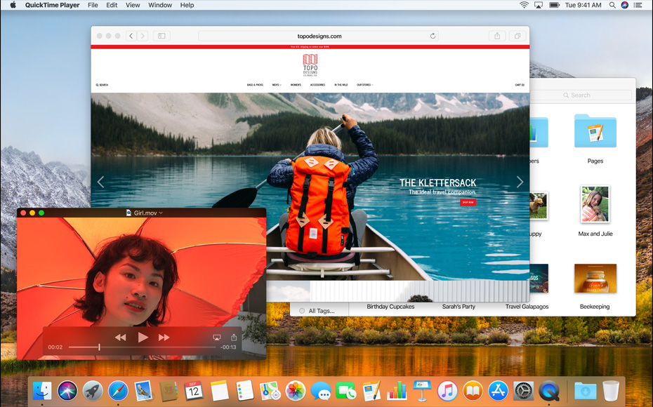

macOS High Sierra es la última actualización del popular sistema operativo de Apple para la gama Mac, en el cual ha ido incorporando un conjunto de mejoras y nuevas funcionalidades que han logrado potenciar cada vez más la productividad en los usuarios amantes de esta plataforma.

Así que si eres de los que posee un Mac, bien sea una iMac, un Mac mini o una Macbook, y aún no te has decidido a actualizar a la nueva versión del macOS High Sierra, esto es lo que tanto tu, como tu Mac se están perdiendo:

## Navegador Safari

Según **Craig Federighi**, Vicepresidente senior de ingeniería de software de Apple, se hicieron importantes mejoras y optimizaciones a Safari lo cual los posiciona como "**el navegador para sistemas de escritorio más rápido del mundo**". A su vez afirmó que Safari ofrecerá mejoras de velocidad de hasta un 80% sobre su principal competidor, **Google Chrome**, especialmente si se trata de procesar y presentar contenido moderno que incluya javascript

A su vez, implementa opciones para ofrecer  a sus usuarios una experiencia de navegación más cómoda y con la menor distracción posible, ya que incorpora una nueva funcionalidad de bloqueo automático, por ejemplo, Safari puede detectar aquellos sitios que reproducen videos de forma automática y delegarte entonces a tí el control sobre si deseas o no verlos.

Además de esto, está programado para recibir Protección de Seguimiento Inteligente, que se supone que debe evitar sitios y servicios de prácticas invasivas utilizando técnicas de aprendizaje automático. Es decir, que te protegerá del acoso de anuncios de productos en los que has mostrado interés recientemente.

## Fotografías

Photos también recibió algunas mejoras y optimizaciones como el reconocimiento facial mejorado, y categorías que se sincronizan en todos los dispositivos de Apple. También se incorporaron opciones de impresión físicas expandidas, como por ejemplo la posibilidad de imprimir fotografías de otras aplicaciones o servicios.

Además, se añadieron más posibilidades de edición y organización, barra lateral mejorada, posibilidad de editar Live Photos, nuevas Memorias, edición utilizando aplicaciones de terceros, mejora de la función caras, la posibilidad de ajustar la curva de color, edición selectiva de color, y funcionalidad que sincronizará las ediciones en varios dispositivos.

## Archivos

Se incorporó el Sistema de Archivos de Apple de 64 bits (APFS). APFS ofrece algunas notables mejoras en la velocidad, lo que fue demostrado por un video de un proceso de copia de alta velocidad que duplica varios archivos de video HD. APFS será el sistema de archivos predeterminado para MacOS y ofrece soporte de cifrado integrado.

## Correo

Apple ha trabajado en algunas actualizaciones de su aplicación de correo, utilizando la compresión para reducir el espacio en disco que utiliza en un 35 por ciento. Además, Split View está ahora configurado para ser utilizado con la ventana de Compose, y Spotlight podrá determinar qué mensajes son más importantes, y darles prioridad sobre otra correspondencia.

Por último y no menos importante, les detallo a manera general algunas otras mejoras que vienen con esta nueva actualización:

- **Siri** habla un lenguaje más natural en algunos idiomas y su motor de recomendaciones para Apple Music se ha retocado.
- **Spotlight** es ahora capaz de buscar información de vuelos a partir de su código.
- **FaceTime** te permite capturar un momento de la llamada en forma de Live Photo.
- **En Notas** puedes ahora organizar textos con más opciones en la barra lateral, y puedes añadir contenido como tablas a las notas.
- **iCloud** te permite compartir espacio de almacenamiento de pago con todos los miembros de la modalidad En Familia, además de poder compartir cualquier archivo mediante iCloud Drive.

Espero que con esto sea suficiente para tomar la decisión y elevar tu Mac hacia lo nuevo que ofrece el nuevo macOS High Sierra. Si deseas conocer un poco más acerca de esta nueva actualización, [haz click aquí](https://www.apple.com/es/macos/high-sierra/).

Si te gustó este post, ayúdame a que pueda servirle a muchas más personas, compartiendo mis contenidos en tus redes sociales.

Espero que este post haya sido de gran ayuda para ti, y como siempre, cualquier inquietud o duda que tengas, puedes contactarme por cualquiera de las vías disponibles, o dejando tus comentarios al final de este post. También puedes sugerir que temas o post te gustaría leer a futuro.

* * *

Si te gustó el post, regálame tus aplausos!!!

\[wp-applause-button style="width:60px;height:60px;margin: 0 auto;" color="black"\]
