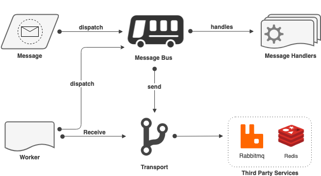
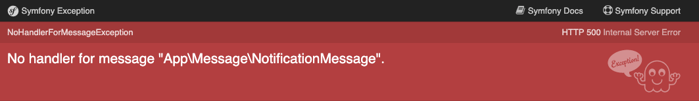
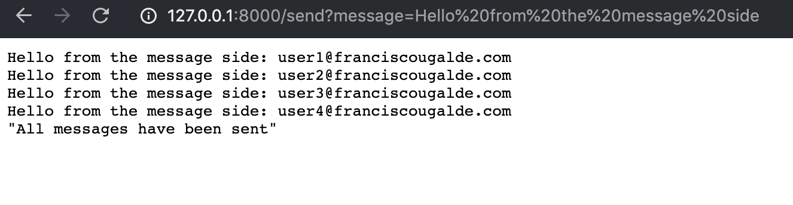

Symfony, desde la versión 4.1, introdujo un nuevo componente el cual denominó "**[Messenger](https://symfony.com/doc/master/components/messenger.html)"**, el cual ha llegado para ayudarnos y facilitarnos la forma en como implementar eventos y sistema de colas.

## Componente Messenger de Symfony

El componente **Messenger** de **Symfony** funciona principalmente mediante el uso de los siguientes conceptos:

- **Messages**: Representa cualquier objeto PHP que pueda ser serializado.
- **Message Bus:** Se refiere al sitio donde enviamos o "**despachamos**" los messages.
- **Message Handler**: Los "**Manejadores de Mensajes**" es donde reside toda la lógica de negocio requerida para cuando un mensaje es despachado.
- **Transports**: Los "**Transportadores**" permiten enviar y recibir mensajes a través de sistemas Third Party como por ejemplo: **[Redis](https://redis.io/)** o **[RabbitMQ](https://www.rabbitmq.com/)**.
- **Worker**s: Permite consumir los mensajes enviados por estos servicios Third Party.

Basándonos en los conceptos anteriores y mediante un par de diagramas, explicar como usar el **componente Messenger de Symfony**.

## Diagrama de flujo básico:


Symfony Messenger - Flujo básico

Una forma sencilla de usarlos es creando un mensaje, el cual es despachado al "**Message** Bus" quien posteriormente sabe que "**Message** **Handler**" es el responsable de atender el mensaje y realizar la lógica correspondiente.

Pero, también podemos combinar el uso de este componente con integraciones de terceros como por ejemplo **RabbitMQ**. Veamos el siguiente diagrama de flujo.

### Diagrama usando Workers y Transports



Symfony Messenger con RabbitMQ / Redis

## Ejemplo sencillo de implementación:

Una vez entendido el esquema básico de Messenger, vamos a ver un ejemplo sencillo de como integrarlo dentro de nuestra aplicación.

Para este ejemplo, te mostraré como hacer un sistema de notificaciones a usuarios para que dado un conjunto de usuarios, simulemos el envío de la notificación.

> Para este ejemplo, asumiremos que ya que tenemos un proyecto de symfony creado.
> 
> ej: symfony new --full my\_project

Lo siguiente que haremos será instalar el componente de **Messenger** de **Symfony:**

composer req symfony/messenger

> No es necesario realizar configuración alguna ya que desde la versión 4 de Symfony, se introdujo Flex el cual mediante recetas nos permite instalar componentes y configurarlos de forma automática.
> 
> Symfony Flex es un plugin de composer que permite gestionar y auto configurar los componentes

A continuación, crearemos nuestra clase **Message** que llamaremos "**NotificationMessage**" la cual representa a los mensajes que enviaremos mediante el **Message Bus**.

```
namespace App\Message;

class NotificationMessage
{
    /**
     * @var string
     */
    private $message;

    /**
     * @var array
     */
    private $users;

    /**
     * @param string $message
     * @param array $users
     */
    public function __construct(string $message, array $users)
    {
        $this->message = $message;
        $this->users = $users;
    }

    /**
     * @return string
     */
    public function getMessage(): string
    {
        return $this->message;
    }

    /**
     * @param string $message
     *
     * @return NotificationMessage
     */
    public function setMessage(string $message): NotificationMessage
    {
        $this->message = $message;

        return $this;
    }

    /**
     * @return array
     */
    public function getUsers(): array
    {
        return $this->users;
    }

    /**
     * @param array $users
     *
     * @return NotificationMessage
     */
    public function setUsers(array $users): NotificationMessage
    {
        $this->users = $users;

        return $this;
    }
}
```

Con nuestro mensaje ya definido, procedemos a crear un controlador para hacer uso de nuestro **Message Bus**, el cual gracias al **autowiring** de **Symfony 4**, se inyecta como dependencia en el método "**sendNotification(...)**" de nuestro controlador.

```
namespace App\Controller;

use App\Message\NotificationMessage;
use Symfony\Bundle\FrameworkBundle\Controller\AbstractController;
use Symfony\Component\HttpFoundation\JsonResponse;
use Symfony\Component\HttpFoundation\Request;
use Symfony\Component\Messenger\MessageBusInterface;
use Symfony\Component\Routing\Annotation\Route;

class NotificationController extends AbstractController
{
    /**
     * @Route(path="/send“, name="notifications_send")
     * @param Request $request
     * @param MessageBusInterface $messageBus
     *
     * @return JsonResponse
     */
    public function sendNotifications(Request $request, MessageBusInterface $messageBus): JsonResponse
    {
        $users = [
            'user1@franciscougalde.com',
            'user2@franciscougalde.com',
            'user3@franciscougalde.com',
            'user4@franciscougalde.com'];

        $messageBus->dispatch(new NotificationMessage($request->get('message'), $users));

        return JsonResponse::create('All messages have been sent');
    }
}
```

Muy sencillo ¿verdad?, Sin embargo, cuando intentemos acceder a la ruta "http://localhost/send?message=Hello from the message side" , recordando establecer como "**query string**" el parámetro "**message**", veremos que nos arroja la siguiente excepción de tipo **NoHandlerForMessageException**.



Todo apunta, a que symfony nos está indicando, que según el primer diagrama de flujo básico, nos falta definir un "**MessageHandler**" para que procese el mensaje que acabamos de despachar al "**MessageBus**".

Así pues, procedamos a crear el "**MessageHandler**" para nuestro mensaje_._

```
namespace App\MessageHandler;

use App\Message\NotificationMessage;

class NotificationHandler
{
    /**
     * @param NotificationMessage $message
     */
    public function __invoke(NotificationMessage $message)
    {
        foreach ($message->getUsers() as $user) {
            echo $message->getMessage().': '.$user.PHP_EOL;
        }
    }
}
```

Como podemos apreciar, acabamos de crear una clase autoinvocable (gracias al método mágico de PHP **\_\_invoke(...)**), la cual actuará de **MessageHandler** para gestionar el envío de la notificación a cada usuario definido.

## Configuración del Handler:

Ahora bien, nos queda un último paso para este primer ejemplo sencillo, el cual es registrar nuestro **MessageHandler** en nuestro fichero **config/services.yaml** y etiquetarla dentro de nuestro contenedor de servicios con el tag **messenger.message\_handler**. De esta forma, el componente **Messenger** de **Symfony**, sabrá que se trata de un **Handler** para nuestra clase **NotificationMessage.**

```
# config/services.yaml

App\MessageHandler\NotificationHandler:
    tags: [messenger.message_handler]
```

Y gracias a nuestra clase autoinvocable **NotificationHandler**, el componente **Messenger** de **Symfony** es capaz de ejecutar nuestra clase cuando un mensaje de tipo **NotificationMessage** se haya despachado al **MessageBus**.

Pero que pasa si tenemos muchos tipos de mensajes?, habría que registar en nuestro fichero **services.yaml** cada uno de los handlers respectivos. Para evitar esto, existe una manera automática de hacerlo a través de la siguiente configuración en nuestro fichero de servicios:

```
# config/services.yaml

App\MessageHandler\:
    resource: '../src/MessageHandler/'
    tags: [messenger.message_handler]
```

Con esto le indicamos a Symfony que todo lo que resida en el directorio `/src/MessageHanlder` deberá etiquetarse como handler del componente **Messenger** (usando el tag **messenger.message\_handler**`)`.

**Symfony** es tan flexible, que existe una tercera manera de etiquetar nuestros handlers sin hacer uso del fichero de servicios y es gracias al **autowiring** de **Symfony**. Basta con implementar la interfaz MessageHandlerInterface en cada uno de nuestros handlers como para que el componente **Messenger** sepa que se trata de un **MessageHandler**.

```
namespace App\MessageHandler;

use App\Message\NotificationMessage;
use Symfony\Component\Messenger\Handler\MessageHandlerInterface;

class NotificationHandler implements MessageHandlerInterface
{
    /**
     * @param NotificationMessage $message
     */
    public function __invoke(NotificationMessage $message)
    {
        foreach ($message->getUsers() as $user) {
            echo $message->getMessage().': '.$user.PHP_EOL;
        }
    }
}
```

Finalmente ya podemos acceder nuevamente a la ruta desde el navegador y ver como se imprimen los mensajes utilizando nuestro componente **Messenger** de **Symfony**.



Como valor adicional, Symfony ha incorporado en su Profiler una nueva sección donde podremos hacer debug para verificar y acceder a todos los mensajes que se hayan despachado.

## Consideraciones finales:

Y ya para terminar con esta primera parte del post, dejame plantearte lo siguiente: ¿Qué pasaría si el envío de cada notificación es mediante un **API** como **Firebase** en el cual los envios pueden tardar en dar una respuesta?, es decir, la petición de envío no generaría un response hasta tanto no termine de envíar la última notificación.

Para este planteamiento es donde entra en juego los **Workers** y los **Transports** ya que permiten enviar de forma asíncrona los mensajes, permitiendo a la petición generar una respuesta al usuario, mientras en background se envían los mensajes.

En la próxima parte, te mostraré como implementar el componente **Messenger** de **Symfony** utilizando los Workers y los **Transports**, para poner en práctica el segundo diagrama de flujo en donde estarémos utilizando RabbitMQ para el procesamiento de la cola de mensajes.

Si quieres revisar en detalle el código de esta primera parte, puedes clonar mi [**repositorio**](https://github.com/franciscougalde-com/sf4-messenger) y situarte sobre la rama "**[part-1](https://github.com/franciscougalde-com/sf4-messenger/tree/part-1)**".

Recuerda que si tienes alguna sugerencia o pregunta, no dudes en dejar tus comentarios al final del post.

Si te gustó este post, ayúdame a que pueda servirle a muchas más personas, compartiendo mis contenidos en tus redes sociales.

Espero que este post haya sido de gran ayuda para ti, y como siempre, cualquier inquietud o duda que tengas, puedes contactarme por cualquiera de las vías disponibles, o dejando tus comentarios al final de este post. También puedes sugerir que temas o post te gustaría leer a futuro.

* * *

Si te gustó el post, regálame tus aplausos!!!

\[wp-applause-button style="width:60px;height:60px;margin: 0 auto;" color="black"\]
