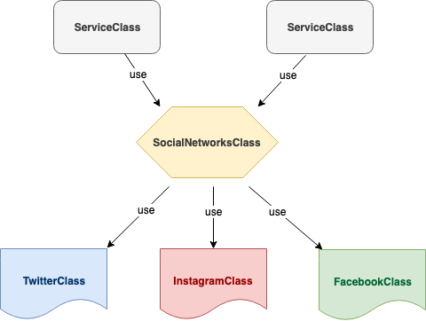

## El patrón FACADE o Fachada

El objetivo principal del patrón de diseño **FACADE** en **PHP** es el de simplificar nuestro sistema gracias a que permite exponer una interfaz mas amigable y fácil de digerir sin necesidad de conocer a fondo cada uno de los sub sistemas que se agrupan en esta "fachada".

Para tratar de entender mejor el concepto, veamos un diagrama para visualizar mejor el patrón **FACADE**:



Diagrama de **FACADE**

Aqui podemos ver que tenemos 3 subsistemas el cual son la clase Twitter, Instagram y Facebook, el cual cuya funcionalidad puede ser agrupada en la clase FACADE que hemos llamado: **SocialNetworksClass** quien posteriormente sera utilizada por cualquier clase de servicio.

Continuando con lo presentado en el diagrama, te muestro un ejemplo de código:

## Ejemplo de implementación del Patrón de diseño FACADE en PHP

```
interface SocialNetworksInterface
{
    public function publish();
    public function follow();
    public function unfollow();
    public function addLike();
    public function retweet();
}

interface TwitterAPIClientInterface
{
    public function tweet();
    public function follow();
    public function unfollow();
    public function addLike();
    public function retweet();
}

interface InstagramAPIClientInterface
{
    public function publish();
    public function follow();
    public function unfollow();
    public function addLike();
}

interface FacebookAPIClientInterface
{
    public function addPost();
    public function addLike();
}

class SocialNetworks implements SocialNetworksInterface
{
    /**
     * @var TwitterAPIClientInterface
     */
    protected $twitterApiClient;

    /**
     * @var InstagramAPIClient
     */
    protected $instagramApiClient;

    /**
     * @var FacebookAPIClient
     */
    protected $facebookApiClient;

    public function __construct(
        TwitterAPIClientInterface $twitterApiClient,
        InstagramAPIClientInterface $instagramApiClient,
        FacebookAPIClientInterface $facebookApiClient
    ) {
    }

    public function publish()
    {
        $this->twitterApiClient->tweet();
        $this->instagramApiClient->publish();
        $this->facebookApiClient->addPost();
    }

    public function follow()
    {
        $this->twitterApiClient->follow();
        $this->instagramApiClient->follow();
    }

    public function unfollow()
    {
        $this->twitterApiClient->unfollow();
        $this->instagramApiClient->unfollow());
    }

    public function addLike()
    {
        $this->twitterApiClient->addLike();
        $this->instagramApiClient->addLike();
        $this->facebookApiClient->addLike();
    }

    public function retweet()
    {
        $this->twitterApiClient->retweet();
    }

}

class TwitterAPIClient implements TwitterAPIClientInterface
{
    public function tweet()
    {
        // tweet() method implementation
    }

    public function follow()
    {
        // follow() method implementation
    }

    public function unfollow()
    {
        // unfollow() method implementation
    }

    public function addLike()
    {
        // addLike() method implementation
    }

    public function retweet()
    {
        // retweet() method implementation
    }

}

class InstagramAPIClient implements InstagramAPIClientInterface
{
    public function publish()
    {
        // publich() method implementation
    }

    public function follow()
    {
        // follow() method implementation
    }

    public function unfollow()
    {
        // unfollow() method implementation
    }

    public function addLike()
    {
        // addLike() method implementation
    }

}

class FacebookAPIClient implements FacebookAPIClientInterface
{
    public function addPost()
    {
        // addPost() method implementation
    }

    public function addLike()
    {
        // addLike() method implementation
    }
}

```

El ejemplo que expongo es a manera ilustrativa de cómo implementar el patrón de diseño **FACADE** en tus proyectos.

En el ejemplo expuesto se puede apreciar como toda la funcionalidad de tres sub sistemas, Twitter, Facebook e Instagram, quedan envueltas en una clase **FACHADA** o **FACADE**.

Esto permite simplificar radicalmente la implementación de uno o varios sub sistemas en clases de servicios o en cualquier otro punto donde sea requerido.

Ademas que la clase que implementa nuestra clase **FACADE** no necesita saber internamente como funciona cada sub sistema.

Recuerda que si tienes alguna sugerencia o pregunta, no dudes en dejar tus comentarios al final del post.

Si te gustó este post, ayúdame a que pueda servirle a muchas más personas, compartiendo mis contenidos en tus redes sociales.

Espero que este post haya sido de gran ayuda para ti, y como siempre, cualquier inquietud o duda que tengas, puedes contactarme por cualquiera de las vías disponibles, o dejando tus comentarios al final de este post.

También puedes sugerir que temas o post te gustaría leer a futuro.  

Si te gustó el post, regálame tus aplausos!!!

\[wp-applause-button style="width:60px;height:60px;margin: 0 auto;" color="black"\]
