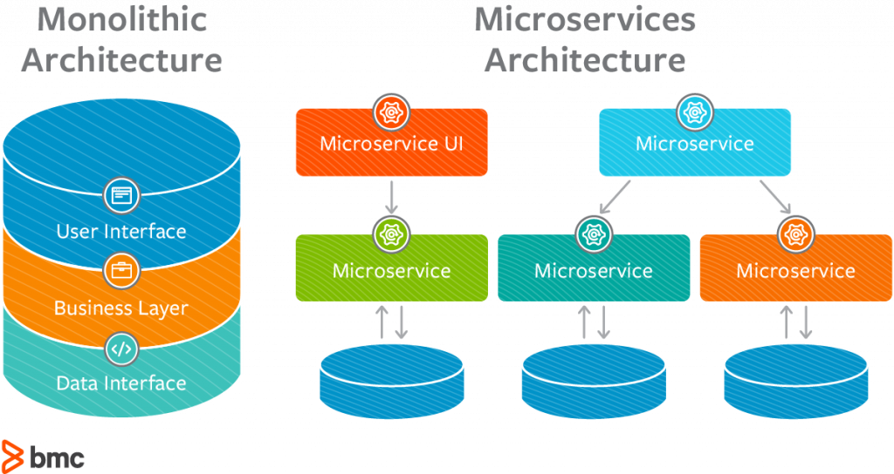

## Introducción a los Microservicios en PHP

La arquitectura basada en **Microservicios en PHP** es un concepto que esta muy de moda y que ha sido implementado por muchos gigantes tecnológicos como Amazon, eBay, Netflix Twitter, Paypal entre otros.

En este post quiero adentrarte un poco sobre lo que es un **microservicios** en comparación a los sistemas monolíticos, cuales son sus ventajas y desventajas y sobre todo, cuando debemos implementar la arquitectura de **Microservicios en PHP**.

**Microservices, Microservices Everywhere!**

## Pero y... ¿Qué son los Microservicios en PHP?

Generalmente, los grandes y complejos sistemas se han desarrollado siguiendo lo que hasta ahora conocemos como sistemas monolíticos (mono-proceso) donde el mantenimiento, escalabilidad y evolución, se tornaba en algo traumático.

**Arquitectura Monolítica vs Arquitectura de Microservicios**

Es aquí en donde aparece la arquitectura basada en **microservicios** el cual su principio se basa en identificar y separar funcionalidad del sistema en **micro proyectos** o **servicios** **autónomos** que trabajan de forma independiente.

**Approach de Microservicios usando API Gateway**

Es decir, cada micro servicio corresponde por así decirlo a un módulo o bundle cuya funcionalidad es específica. Y que se estará ejecutando de forma paralela en distintos servidores y comunicándose entre ellos por diferentes vías disponibles: **Http** **Request**, **Proyecciones**, **Colas** de **Mensajes**, entre otros.

**Approach de Microservicios usando Cola de Mensajes**

Cada **microservicio** es responsable de brindar solución a un área de negocio concreta, abstrayendo al resto del sistema de los detalles concretos de la implementación, favoreciendo su **independencia**, el **mantenimiento** y la **evolución** de cada uno de ellos.

Al gestionar cada micro servicio como un pequeño sistema, nos da la posibilidad de ser desplegados sin perjudicar a los demás, favoreciendo así la **escalabilidad**.

## ¿Cuáles son sus ventajas?

- Potencia la diversidad tecnológica: es decir, podemos utilizar distintos stacks tecnológicos para cada microservicio, incluso, distintos lenguajes de programación.
- Permite despliegues independientes.
- La capacidad de testing de cada microservicio es mayor.
- Permite que los desarrollos sean independientes y puedan avanzar en paralelo.
- La escalabilidad se torna mas eficiente y continua.
- Facilita el mantenimiento a lo largo del tiempo.

## ¿Cuáles son sus desventajas?

Las desventajas de los **microservicios** se deben en gran parte a la introducción del concepto de **sistemas** **distribuidos**, algunas de estas son:

- Aumentará la complejidad en la gestión de la configuración y despliegue por lo que cada **microservicio** va a requerir su propia configuración de build, testing, despliegue (Jenkins, CircleCI, Git, etc.).
- Aumenta la complejidad para mantener la transaccionalidad de cada operación.
- El rendimiento se puede ver afectado debido a saturaciones de la red o a procesos de (de)serialización.
- Monitorizar el sistema será más complejo.
- Será más difícil gestionar los errores correctamente.

## ¿Cuándo implementar la arquitectura de Microservicios en PHP?

La arquitectura de **microservicios** supone un esfuerzo extra a los desarrolladores no solo a nivel de implementación si no a nivel de configuración, comunicación, monitorización, manejo de los errores, registro y log de transacciones, entre otros, ademas de otros factores derivados de los sistemas distribuidos.

Todo esto supone un coste de esfuerzo/tiempo añadido al proyecto que debe ser estimado debidamente antes de tomar la decisión final de si implementar o no esta **arquitectura** de **microservicios**.

La decisión de si utilizar o no este tipo de diseño a la hora de desarrollar nuestro software se fundamenta básicamente en el nivel complejidad que va a alcanzar.

Si el nivel de complejidad del software es bajo, no es aconsejable dedicar esfuerzos en implementar esta arquitectura.

Como mencioné anteriormente la finalidad de esta arquitectura de **microservicios** es tratar de distribuir la complejidad de los sistemas en pequeñas piezas cuya responsabilidad o función sea única.

A partir de cierto nivel de complejidad del sistema, las ventajas que ofrecen los microservicios harán viable el esfuerzo necesario que la productividad del equipo sea mayor.

## Consideraciones Finales

La arquitectura de microservicios viene a resolver importantes retos y problemas relacionados a la complejidad de los sistemas actuales.

Y es que gracias a una buena implementación de los mismos garantizan que sistemas complejos, puedan ser gestionados y administrados de forma eficiente.

Sin embargo, hay que tener pulso y mucho tacto a la hora de decidir si utilizar o no esta arquitectura.

Si tienes dudas en cuanto a si utilizar o no esta arquitectura yo te sugiero que pienses en el siguiente flujo de decisiones:

1. Inicies el desarrollo del software como un simple sistema monolítico.
2. Si la complejidad aumenta con cada versión y sientes que se esta convirtiendo en algo insostenible, puedes proceder a pasar de **monolítico** a **microservicios**.

Lo interesante de la arquitectura de **microservicios** es que es totalmente **flexible** y puede ser usado también como patrón de refactoring.

Ya que permite que un sistema **monolítico** se convierta en multiple **microservicios**.

## Algunas Referencias

Puedes leer más al respecto en los siguientes artículos.

- [Enterprise Approaches to Microservices: Choose Yours Wisely](https://www.netsolutions.com/insights/best-enterprise-approaches-to-microservices/), [SIDDHARTHA BHATIA ](https://www.netsolutions.com/insights/author/siddhartha_bhatia/)
- [Microservices](http://martinfowler.com/articles/microservices.html). James Lewis y Martin Fowler.
- Sam Newman, «The Principles of Microservices», 2015
- [Microservices in a Nutshell. Pros and Cons.](http://blog.philipphauer.de/microservices-nutshell-pros-cons/#Benefits_in_General) Philipp Hauer.

Recuerda que si tienes alguna sugerencia o pregunta, no dudes en dejar tus comentarios al final del post.

Si te gustó este post, ayúdame a que pueda servirle a muchas más personas, compartiendo mis contenidos en tus redes sociales.

Espero que este post haya sido de gran ayuda para ti, y como siempre, cualquier inquietud o duda que tengas, puedes contactarme por cualquiera de las vías disponibles, o dejando tus comentarios al final de este post. También puedes sugerir que temas o post te gustaría leer a futuro.

* * *

Si te gustó el post, regálame tus aplausos!!!

\[wp-applause-button style="width:60px;height:60px;margin: 0 auto;" color="black"\]
